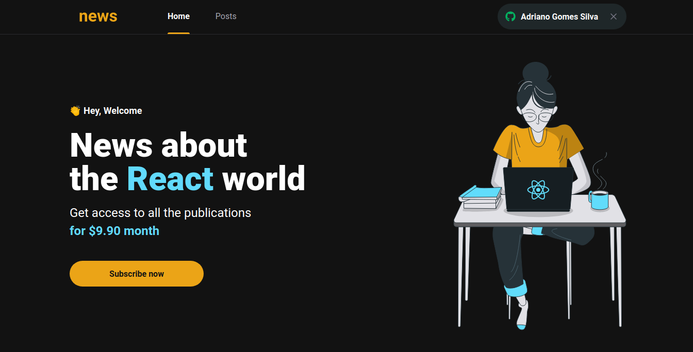

<div align="center">
 
</div>

<!-- <p>O <strong>money</strong> é uma aplicação de controle financeiro </p>


 -->

## Technologies used
  - [NextJS](https://nextjs.org/)
  - [Typescript](https://www.typescriptlang.org)
  - [Sass](https://sass-lang.com/)

## Config used
  - [Eslint](https://eslint.org)
  - [Husky](https://typicode.github.io/husky/#/)
  - [Lint Staged](https://github.com/okonet/lint-staged)
  - [Editor Config](https://editorconfig.org/)

## Getting Started

First, install all dependencies:

```bash
yarn install
```

Second, run the development server:

```bash
yarn dev
```

Open [http://localhost:3000](http://localhost:3000) with your browser to see the result.

