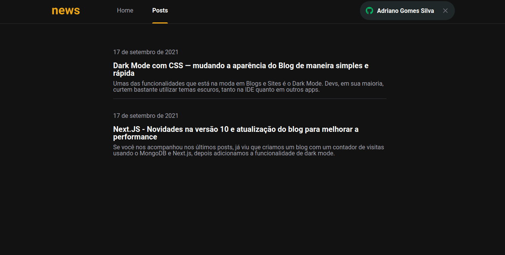

<div align="center">
 
</div>

<p>O projeto <strong>News</strong> é um blog onde os usuários podem ter acesso ao conteúdo de cada postagem de acordo com o status de sua assinatura.
O blog possui um sistema de compra integrado com o STRIPE, e após o usuário realizar o pagamento, sua inscrição estará ativa e pronta para visualizar o conteúdo completo de todo o blog. Caso o usuário não deseje optar pela assinatura, ele terá acesso limitado ao conteúdo das postagens. E todos os dados necessários para se fazer verificações de assinaturas ou dados dos usuários, estão salvos no banco de dados FaunaDB.

Essa é uma aplicação Serverless, ou seja, todo o processo que dependeria de um backend foi integrado dentro do front e seguindo o padrão da JAMStack.
As postagens são feitas pelo painel do Prismic CMS e integradas diretamente pelo front.</p>




## Technologies used
  - [NextJS](https://nextjs.org/)
  - [Next Auth](https://next-auth.js.org/)
  - [Typescript](https://www.typescriptlang.org/)
  - [Sass](https://sass-lang.com/)
  - [FaunaDB](https://fauna.com/)
  - [Stripe](https://stripe.com/)
  - [Primisc CMS](https://prismic.io/)

## Config used
  - [Eslint](https://eslint.org)
  - [Husky](https://typicode.github.io/husky/#/)
  - [Lint Staged](https://github.com/okonet/lint-staged)
  - [Editor Config](https://editorconfig.org/)

## Getting Started

Guide to install stripe

```bash
https://stripe.com/docs/stripe-cli
```

First, install all dependencies:

```bash
yarn install
```

Second, run the development server:

```bash
yarn dev
```

Third, run the development server:

```bash
stripe listen --forward-to localhost:3000/api/webhooks
```

Open [http://localhost:3000](http://localhost:3000) with your browser to see the result.

